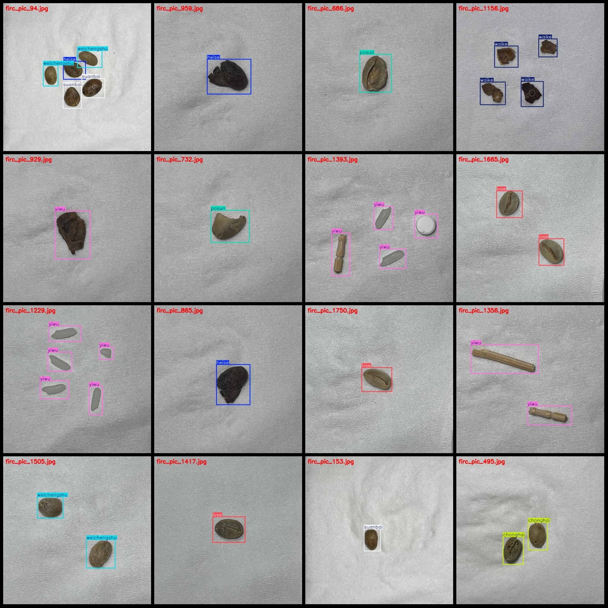
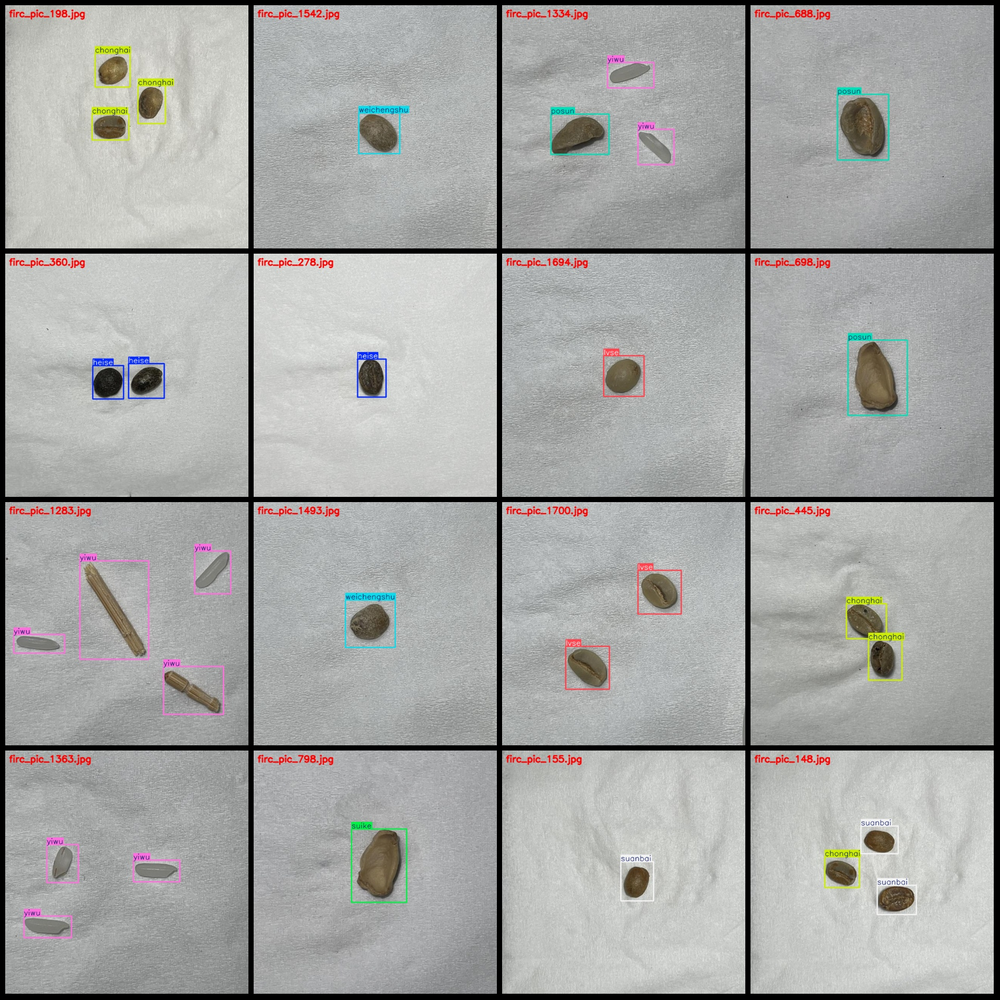

# Coffee Bean Quality Detection Dataset VOC + YOLO format, 1799 images, 9 categories

Dataset format: Pascal VOC format + YOLO format (without split path in the txt file, only contain jpg images and corresponding VOC format xml files and YOLO format txt files)
Number of images (number of jpg files): 1799
Number of annotations (number of xml files): 1799
Number of annotations (number of txt files): 1799
Number of annotation categories: 9
Label names for annotations (Note: the order of labels in the YOLO format does not correspond to this, but is based on the classes.txt in the labels folder): ["chonghai", "heise", "lvse", "posun", "suanbai", "suike", "waike", "weichengshu", "yiwu"]
"Black", "Green", "Broken", "Rotten", "Crushed", "Shells", "Unripe", "Foreign Objects" are the categories that correspond to "Black".
Number of boxes for each category:
chonghai boxes = 412
heise boxes = 527
lvse boxes = 454
posun boxes = 221
suanbai boxes = 236
suike boxes = 169
waike boxes = 543
Weichengshu frame count = 277  
Yiwu frame count = 586  
Total frame count: 3425  
Number of images per category:  
Chonghai image count = 249  
Heise image count = 357  
Lvse image count = 296  
Posun image count = 201  
Suanbai image count = 121  
Suike image count = 126  
Waike image count = 201  
Weichengshu image count = 213  
Yiwu image count = 220  
Image resolution: 640x640  
Labeling tool used: labelImg
Annotation rule: Draw a rectangle around the class.
Important note: The dataset does not have a split for training, validation, and testing. Please manually divide it.
Special Disclaimer: This dataset does not guarantee the accuracy of any trained models or weight files.
Preview image:
## Images

Here is a pay link on Stripe ( https://buy.stripe.com/3cs8yP7sY87d0vu9AB ). Please contact me lonlonago@foxmail.com after funding $89, and I will send you a complete data files , thank you!

